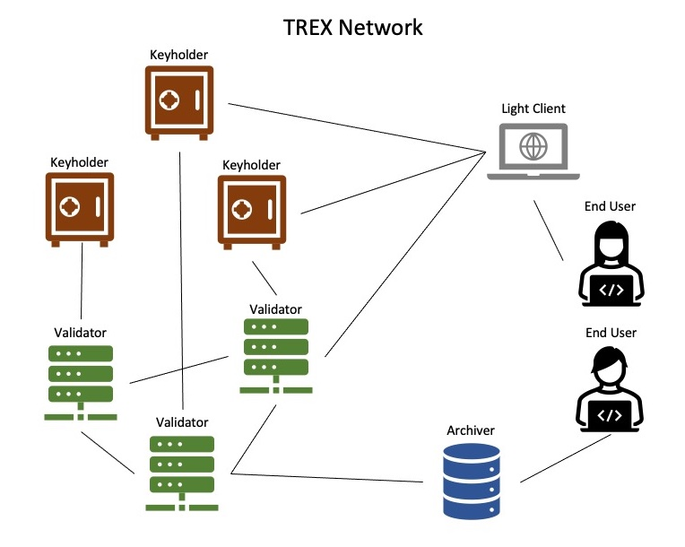

The TREX network is a distributed peer-to-peer network that has no center. Thus, there is no need to use any central time server for timed-release encryption and decryption. 

# Network
The TREX network comprises different types of nodes and forms a decentralized system for timed-release encryption. As shown in the figure, end users can use the light client to prepare key splitting in a threshold way and send them to different keyholders. In addition, the light client can help end users encrypt data and send it to the validator so that the blockchain validates the timestamp of encrypted data.

The keyholders will hold the key until the release time. Then, the pieces of the secret key can be put on the blockchain. Next, the validator will verify a piece of key and send keyholders a reward for holding keys. Finally, the archiver will collect all pieces of the key and reconstruct a key to decrypt the original data. Then, other end users can access the released data by accessing the archiver’s secondary database. The keyholder operates as off-chain workers and does not participate in the consensus. The consensus among validators will ensure the immutability of the original data and its timestamp. 

The archiver only consumes data from the network and does not write any data into the network.
The light client and archiver provide convenient interfaces to write and read dTRE data without complicated network operations.  
The validator and keyholder support the network consensus and functionality so that the front-end users can receive fast and reliable decentralized services.

## Light client
The light client does not contain all blockchain data compared to the full node. Instead, it only includes block headers to initiate and validate extrinsic data from regular users. The light node does not need to run 24/7. The light node allows users to sync with the whole network faster using much lower internet bandwidth. The light node can run on any modern computing device, from Raspberry Pi to smartphones, or run in a web browser as WASM codes. It enables users from anywhere with an internet connection to encrypt contents anonymously and send them to the TREX network. The light node will be the most popular type of client on the TREX network running with data encryption applications.

## Archiver service
The archiver nodes record all historical blocks and decrypt data into a secondary database. The secondary database is built with PostgreSQL, which provides high-performance query and indexing on blockchain data. In addition, an HTTP server can serve along with the archiver node as a portal for regular users to search and browse published data and verify the previously hidden data.

The following pages will introduce more details about different nodes in this system as a building block to achieve decentralized timed-release encryption for Web3 interoperability.
