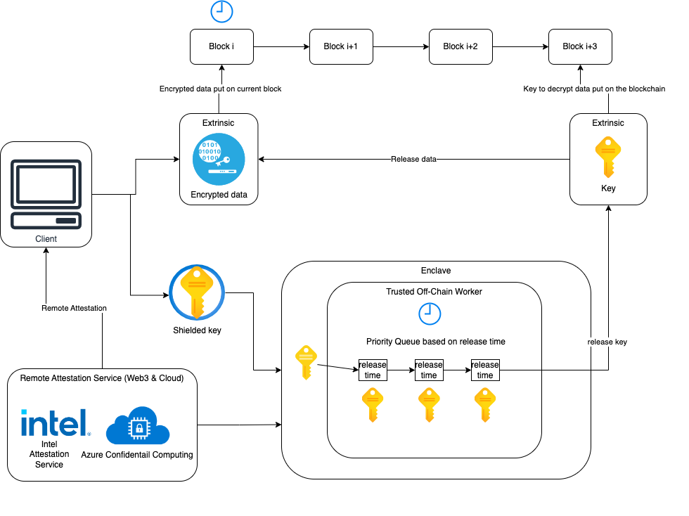

The core functionality of the TREX network is the formation of a robust and secured decentralized system for timed-release encryption. The below figure describes the typical workflow and system architecture.

# How the TREX network works

The client, who will encrypt a message and schedule the release of the encrypted message on the blockchain, shall determine the block height for its corresponding release time. Then, the client shall acquire on-chain reports for a list of trusted keyholders (trusted off-chain workers), which have been verified by a type of remote attestation service (e. g. Integritee Network and Azure Confidential Computing). Then, the client can optionally split the key for an extra layer of security and robustness and send the shielded key to the keyholder nodes that runs off-chain workers inside TEEs. Finally, the key will be put into a queue inside the TEE enclave and waiting for its release.

When the block is generated at a certain height on the release time, the decentralized timed-release mechanism automatically releases the corresponding encryption key so that the message can be decrypted and released publicly on the release time. Anyone could unlock and acquire the released data by accessing immutable blockchain data.

## Key splitting
The key-splitting method uses [Shamir's Secret Sharing](https://en.wikipedia.org/wiki/Shamir%27s_Secret_Sharing) algorithm to distribute the shielded key to the TREX network. The front-end App uses a WASM library to generate multiple key pieces in a threshold way. For example, if there are 100 keyholder nodes, the App can run an RPC call to query a list of randomly picked nodes and use 2/3 of the number of nodes as a threshold. That way, the data encryption is secured unless more than 2/3 of keyholder nodes were physically hacked. Since the App performs all key-splitting operations, users do not have to trust any entity to handle their time-sensitive data.